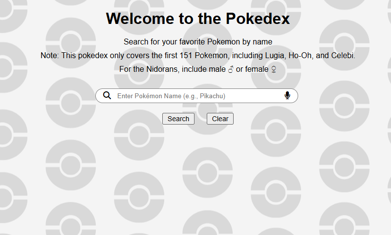
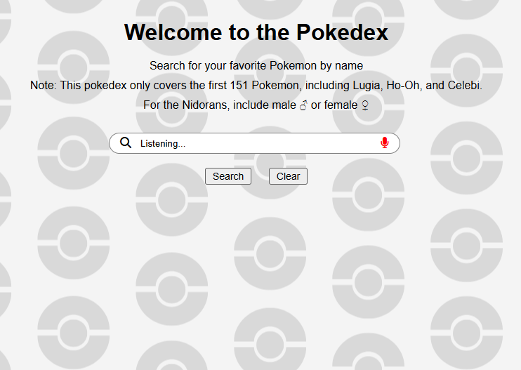
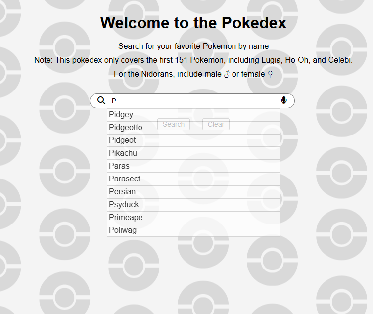
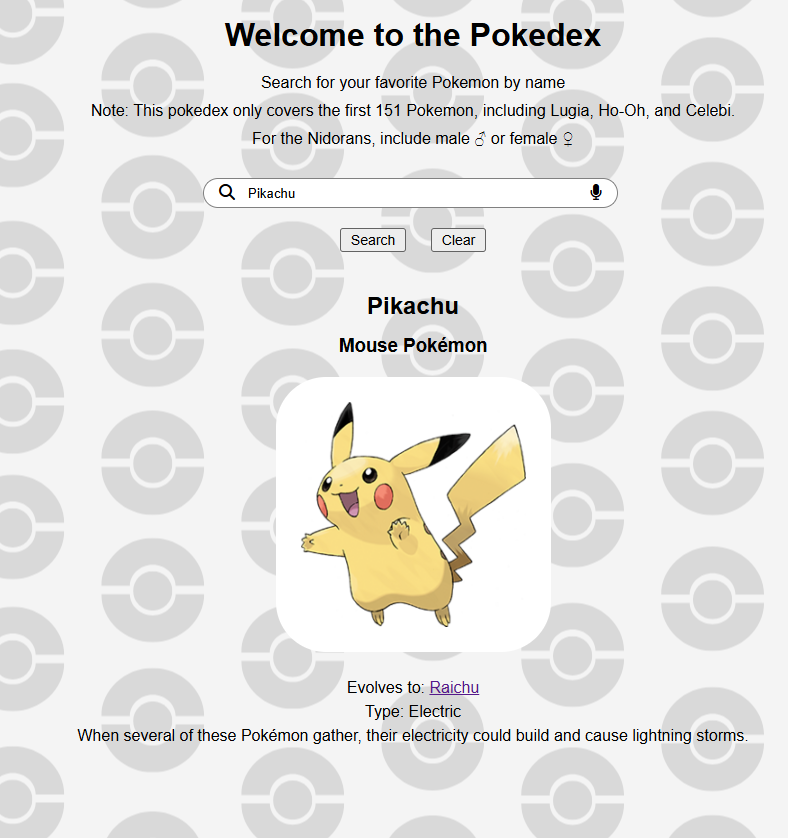

# Pokédex

A full-stack project that allows a user to search for a Generation I Pokémon and retrieve information about the searched Pokémon.

## Technology Used

- MongoDB (Atlas or Compass) v4.16.0
- Flask v3.1.2
- Visual Studio Code
- SpeechRecognition API

## Features

- Search for a pokémon by name
- Clear web page of all data
- Generate a list of Pokémon names based on user input
- Load the page with data when,
  - clicking on an auto-suggestion
  - clicking on links to different Pokémon
- Use speech recognition to listen for a Pokémon name, and either
  - generate an error message if data is not found, or
  - reload the page with the appropriate data

# Screenshots

# How to use it

- Install MongoDB Atlas or Compass
- Create a cluster
- Create a database called pokedex
- Create a collection called pokemon
- Load data from JSON file to the collection
- Install Extension: MongoDB for VS Code
- Complete Extension Set Up (needed in order to connect your MongoDB account to MongoDB)
- Open Terminal and type: py app.py or python app.py
- To close, either Ctrl+C in terminal, and close the browser.
